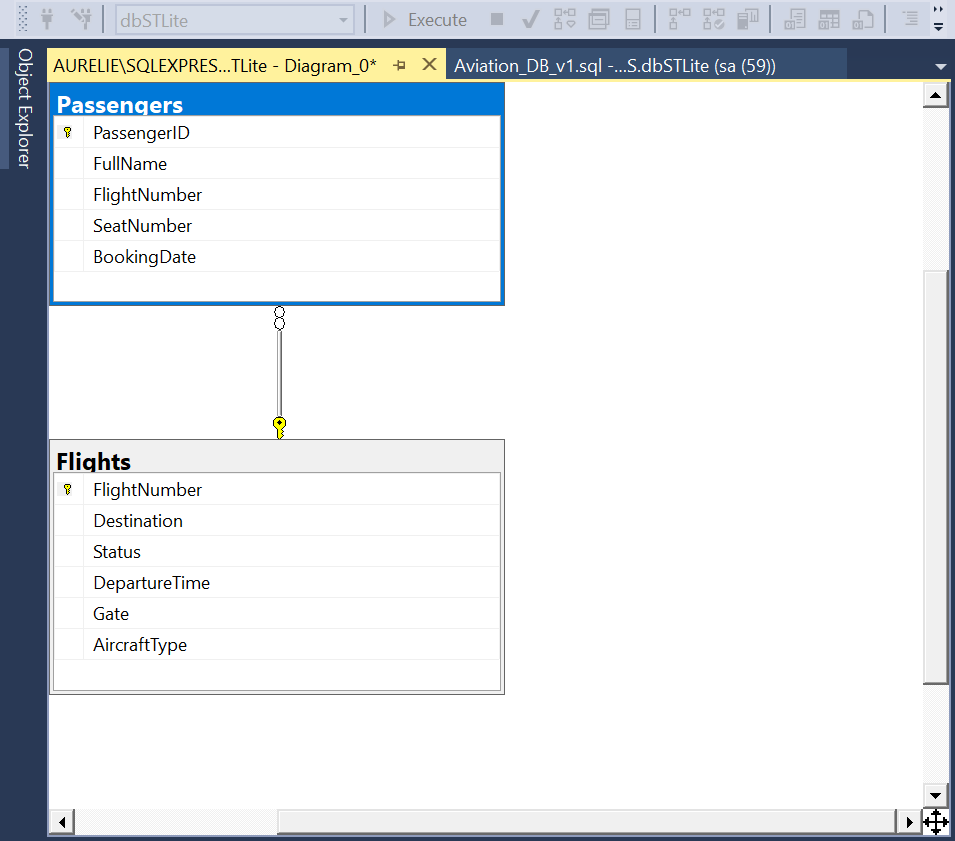

## 🛠 Phase 1: Database Architecture
In this initial phase, I have architected the core relational structure for the system.

- **Status:** Completed ✅
- **Key Achievement:** Defined the core relationship between `Flights` and `Passengers` with strict **integrity constraints**.
- **Data Safety:** Implemented Foreign Keys to ensure that no passenger can be assigned to a non-existent flight, mimicking real-world aviation safety protocols.

### Database Schema Visualization:
 
*(Note: If the image doesn't show, make sure you uploaded 'db_schema.png' to the same folder)*
